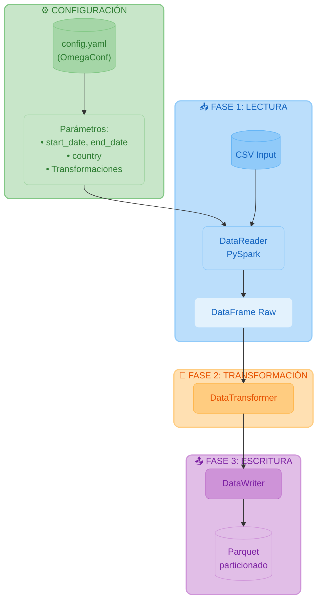
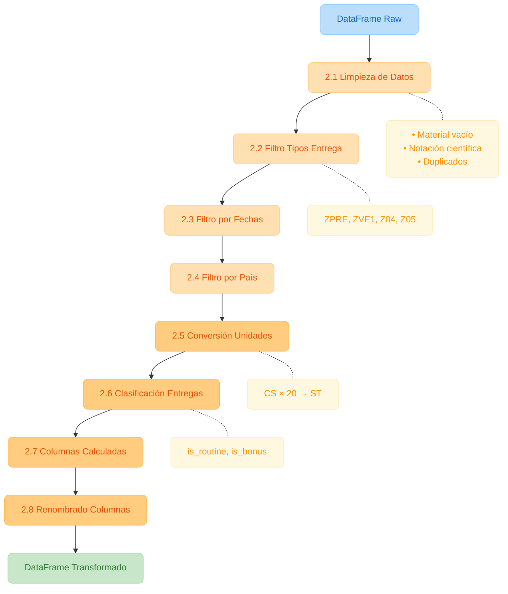
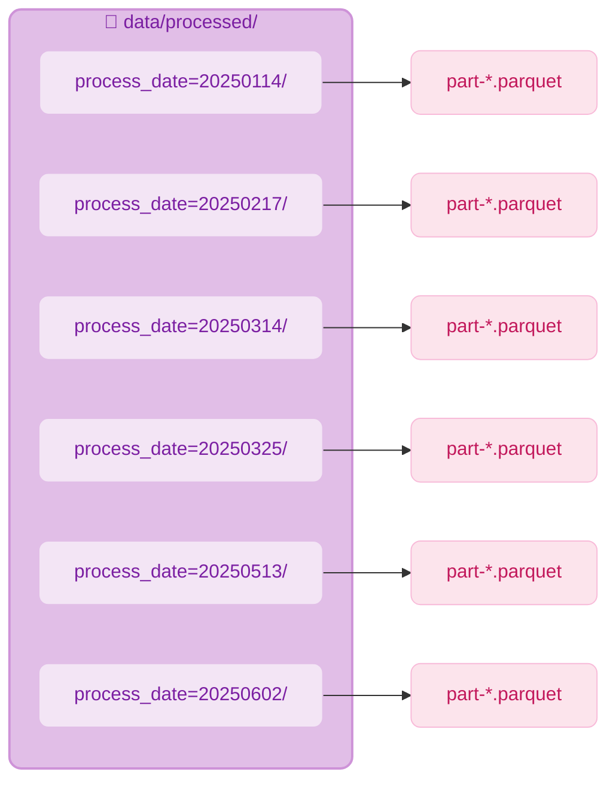

# ETL Flujo de Datos - Entregas de Productos


## Descripción

ETL para el procesamiento de entregas de productos, desarrollado con **PySpark** y configurado con **OmegaConf**. El sistema permite procesar datos de entregas de múltiples países y entornos, con parametrización flexible por rango de fechas y país.

## Arquitectura Visual

### Flujo Principal del ETL



### Pipeline de Transformaciones



### Estructura de Salida (Particiones)



## Características

- ✅ **Parametrizable por fechas**: Procesa datos en un rango de fechas configurable
- ✅ **Filtro por país**: Permite procesar datos de un país específico
- ✅ **Conversión de unidades**: Convierte cajas (CS) a unidades (ST)
- ✅ **Clasificación de entregas**: Identifica entregas de rutina y bonificaciones
- ✅ **Limpieza de datos**: Elimina duplicados, registros vacíos y corrige anomalías
- ✅ **Configuración flexible**: Usa OmegaConf para gestión de configuración YAML
- ✅ **Dockerizado**: Ejecutable en contenedores con Docker Compose

## Estructura del Proyecto

```
etl_flujo_datos/
├── docker-compose.yml          # Infraestructura Spark
├── requirements.txt            # Dependencias Python
├── config/
│   └── config.yaml             # Configuración del ETL (OmegaConf)
├── src/
│   ├── __init__.py
│   ├── main.py                 # Script principal
│   ├── etl/
│   │   ├── __init__.py
│   │   ├── reader.py           # Lectura de datos CSV
│   │   ├── transformer.py      # Transformaciones de datos
│   │   └── writer.py           # Escritura de datos Parquet
│   └── utils/
│       ├── __init__.py
│       └── config_loader.py    # Carga de configuración OmegaConf
├── data/
│   ├── input/                  # Datos de entrada (CSV)
│   └── processed/              # Datos de salida (Parquet particionado)
└── README.md
```

## Requisitos Previos

- Docker
- Python 3.9+ (para ejecución local)

## Instalación

### 1. Clonar el repositorio

```bash
git clone <repository-url>
cd etl_flujo_datos
```

### 2. Configurar datos de entrada

Asegúrate de que el archivo CSV de entrada esté en `data/input/`:

```bash
ls data/input/
# global_mobility_data_entrega_productos.csv
```

## Ejecución

> **Nota**: Este proyecto utiliza PySpark en modo local embebido (`local[*]`), ideal para desarrollo y procesamiento en una sola máquina. Para clusters distribuidos, se requiere configuración adicional.

### Opción 1: Usando Makefile (Recomendado)

```bash
# Ver comandos disponibles
make help

# Construir imagen Docker (primera vez)
make build

# Ejecutar el ETL con configuración por defecto
make run

# Ejecutar con parámetros personalizados
make run-custom START=2025-01-01 END=2025-06-30 COUNTRY=GT

# Iniciar contenedor de desarrollo interactivo
make dev
```

### Opción 2: Docker Compose Directo

```bash
# Construir imagen
docker compose build

# Ejecutar ETL con configuración por defecto
docker compose run --rm etl-run

# Ejecutar con parámetros personalizados
docker compose run --rm etl-dev python src/main.py \
  --config config/config.yaml \
  --start-date 2025-01-01 --end-date 2025-06-30 --country GT

# Iniciar contenedor de desarrollo interactivo
docker compose run --rm etl-dev bash

# Limpiar contenedores
docker compose down --remove-orphans
```

### Opción 3: Ejecución Local (sin Docker)

```bash
# Instalar dependencias
pip install -r requirements.txt

# Ejecutar ETL
cd etl_flujo_datos
python src/main.py --config config/config.yaml
```

## Parámetros de Ejecución

| Parámetro | Descripción | Ejemplo |
|-----------|-------------|---------|
| `--config` | Ruta al archivo de configuración YAML | `config/config.yaml` |
| `--start-date` | Fecha de inicio del rango (YYYY-MM-DD) | `2025-01-01` |
| `--end-date` | Fecha de fin del rango (YYYY-MM-DD) | `2025-06-30` |
| `--country` | Código de país a procesar | `GT`, `PE`, `EC`, `SV`, `HN`, `JM` |

### Ejemplos de Uso

```bash
# Procesar todo el rango de fechas por defecto
python src/main.py --config config/config.yaml

# Procesar primer trimestre 2025
python src/main.py --config config/config.yaml \
  --start-date 2025-01-01 --end-date 2025-03-31

# Procesar solo Guatemala
python src/main.py --config config/config.yaml --country GT

# Procesar Perú en enero 2025
python src/main.py --config config/config.yaml \
  --start-date 2025-01-01 --end-date 2025-01-31 --country PE
```

## Tests

### Usando Makefile (Recomendado)

El Makefile detecta automáticamente el motor de contenedores disponible:

```bash
# Ver comandos disponibles y motor de contenedores detectado
make help

# Construir imagen Docker (solo la primera vez)
make build

# Ejecutar todos los tests
make test

# Ejecutar tests específicos
make test-config       # Tests de config_loader (54 tests)
make test-reader       # Tests de reader (9 tests)
make test-transformer  # Tests de transformer (18 tests)
make test-writer       # Tests de writer (8 tests)

# Limpiar contenedores huérfanos
make clean
```

### Usando docker-compose directamente

```bash
# Ejecutar todos los tests
docker compose run --rm etl-test

# Ejecutar tests específicos
docker compose run --rm etl-dev pytest tests/test_config_loader.py -v
docker compose run --rm etl-dev pytest tests/test_transformer.py -v
```

### Estructura de Tests

```
tests/
├── conftest.py           # Fixtures compartidas (Spark session, datos de prueba)
├── test_config_loader.py # Tests para ConfigLoader y parse_cli_arguments (54 tests)
├── test_reader.py        # Tests para DataReader (9 tests)
├── test_transformer.py   # Tests para DataTransformer (18 tests)
└── test_writer.py        # Tests para DataWriter (8 tests)
```

### Cobertura de Tests

| Módulo | Tests | Cobertura |
|--------|-------|-----------|
| `config_loader.py` | 54 | ConfigLoader, validaciones, CLI arguments |
| `reader.py` | 9 | Lectura CSV, esquemas, manejo de errores |
| `transformer.py` | 18 | Transformaciones, conversiones, clasificaciones |
| `writer.py` | 8 | Escritura Parquet, particionado |

## Configuración

El archivo `config/config.yaml` contiene toda la configuración del ETL:

```yaml
# Filtros parametrizables
filters:
  start_date: "2025-01-01"    # Fecha de inicio
  end_date: "2025-06-30"      # Fecha de fin
  country: null               # null = todos los países

# Transformaciones
transformations:
  unit_conversion:
    cs_to_st_factor: 20       # 1 caja = 20 unidades
  delivery_types:
    routine:                  # Entregas de rutina
      - "ZPRE"
      - "ZVE1"
    bonus:                    # Entregas con bonificaciones
      - "Z04"
      - "Z05"

# Salida
output:
  format: "parquet"           # Formato de salida
  partition_column: "process_date"  # Columna de partición
```

## Transformaciones Aplicadas

### 1. Limpieza de Datos
- Elimina registros con `material` vacío
- Corrige precios en notación científica (`0E-18` → `0`)
- Elimina registros duplicados

### 2. Filtrado
- Solo tipos de entrega válidos (ZPRE, ZVE1, Z04, Z05)
- Excluye tipo COBR y otros no especificados

### 3. Conversión de Unidades
- **CS (Cajas)**: Se multiplica cantidad × 20
- **ST (Unidades)**: Se mantiene igual
- Nueva columna `quantity_standardized` con cantidad en unidades

### 4. Clasificación de Entregas
- `is_routine_delivery`: True para ZPRE, ZVE1
- `is_bonus_delivery`: True para Z04, Z05

### 5. Columnas Adicionales
- `unit_price`: Precio por unidad
- `total_value`: Valor total (precio × cantidad estandarizada)
- `processing_timestamp`: Fecha/hora de procesamiento
- `data_quality_flag`: Indicador de calidad (VALID/REVIEW)

## Esquema de Datos

### Entrada (CSV)

| Columna | Tipo | Descripción |
|---------|------|-------------|
| pais | String | Código de país (GT, PE, EC, SV, HN, JM) |
| fecha_proceso | String | Fecha de proceso (YYYYMMDD) |
| transporte | String | ID del transporte |
| ruta | String | ID de la ruta |
| tipo_entrega | String | Tipo de entrega (ZPRE, ZVE1, Z04, Z05, COBR) |
| material | String | Código del material |
| precio | Decimal | Precio del producto |
| cantidad | Decimal | Cantidad del producto |
| unidad | String | Unidad de medida (CS, ST) |

### Salida (Parquet)

| Columna | Tipo | Descripción |
|---------|------|-------------|
| country_code | String | Código de país |
| process_date | String | Fecha de proceso |
| transport_id | String | ID del transporte |
| route_id | String | ID de la ruta |
| material_code | String | Código del material |
| delivery_type | String | Tipo de entrega |
| is_routine_delivery | Boolean | Es entrega de rutina |
| is_bonus_delivery | Boolean | Es entrega con bonificación |
| quantity_original | Decimal | Cantidad original |
| unit_original | String | Unidad original |
| quantity_standardized | Decimal | Cantidad estandarizada (ST) |
| unit_standardized | String | Unidad estándar (ST) |
| price | Decimal | Precio |
| unit_price | Decimal | Precio unitario |
| total_value | Decimal | Valor total |
| data_quality_flag | String | Indicador de calidad |
| processing_timestamp | Timestamp | Fecha de procesamiento |

## Reglas de Negocio

### 1. Conversión de Unidades

- **CS (Cajas)**: 1 caja = 20 unidades
- **ST (Unidades)**: Unidad base
- Todas las cantidades se convierten a ST para estandarización

### 2. Tipos de Entrega

| Código | Clasificación | Descripción |
|--------|--------------|-------------|
| ZPRE | Rutina | Entregas de rutina |
| ZVE1 | Rutina | Entregas de rutina |
| Z04 | Bonificación | Entregas con bonificaciones |
| Z05 | Bonificación | Entregas con bonificaciones |
| COBR | Excluido | No incluido en output |
| Otros | Excluido | No incluido en output |

### 3. Limpieza de Datos

- **Material vacío**: Registros con `material` vacío o nulo son eliminados
- **Duplicados**: Registros duplicados son eliminados
- **Notación científica**: Valores como `0E-18` son convertidos a `0`

### 4. Calidad de Datos

Flag `data_quality_flag`:
- **VALID**: Registro con precio > 0, cantidad > 0 y material no vacío
- **REVIEW**: Registro que no cumple las condiciones anteriores

## Anomalías Detectadas en los Datos

1. **Registros con material vacío**: Se encontraron registros donde el campo `material` está vacío o contiene solo comillas (`""`). Estos registros son eliminados.

2. **Precios en notación científica**: Algunos precios tienen el valor `0E-18` que representa cero en notación científica. Estos son convertidos a `0`.

3. **Registros duplicados**: El dataset contiene registros duplicados que son eliminados durante el procesamiento.

4. **Tipos de entrega no válidos**: El tipo `COBR` no está en la lista de tipos válidos y es excluido del output.

## Estructura de Salida

Los datos se escriben en formato Parquet, particionados por `process_date`:

```
data/processed/
├── process_date=20250114/
│   └── part-*.parquet
├── process_date=20250217/
│   └── part-*.parquet
├── process_date=20250314/
│   └── part-*.parquet
├── process_date=20250325/
│   └── part-*.parquet
├── process_date=20250513/
│   └── part-*.parquet
└── process_date=20250602/
    └── part-*.parquet
```

## Tecnologías Utilizadas

- **PySpark 3.5**: Motor de procesamiento distribuido
- **OmegaConf 2.3**: Gestión de configuración YAML
- **Parquet**: Formato de almacenamiento columnar
- **Docker**: Contenedorización

## Arquitectura y Patrones de Diseño

### Pipeline Pattern

Este ETL implementa el **Pipeline Pattern**, donde los datos fluyen secuencialmente a través de etapas bien definidas:

```
[CSV Input] → [Reader] → [Transformer] → [Writer] → [Parquet Output]
```

**Características:**
- Cada etapa tiene una responsabilidad única y bien definida
- Los datos fluyen en una sola dirección (unidireccional)
- Las etapas son componibles y reutilizables
- Facilita el testing unitario de cada componente

### Functional Core, Imperative Shell

El diseño sigue el principio **Functional Core, Imperative Shell**:

| Capa | Descripción | Ejemplo en el proyecto |
|------|-------------|------------------------|
| **Functional Core** | Lógica de negocio pura, sin efectos secundarios | `transformer.py` - transformaciones de datos |
| **Imperative Shell** | Interacción con el mundo exterior (I/O) | `reader.py`, `writer.py`, `main.py` |

**Beneficios:**
- La lógica de transformación es predecible y testeable
- Los efectos secundarios (lectura/escritura) están aislados en los bordes
- Facilita el razonamiento sobre el código

### ¿Por qué no Arquitectura Hexagonal?

La **Arquitectura Hexagonal** (Ports & Adapters) no es ideal para este caso porque:

1. **Flujo lineal**: Un ETL es inherentemente secuencial (E→T→L), no tiene múltiples "puertos" de entrada/salida que justifiquen la abstracción
2. **Dependencia de Spark**: Toda la lógica depende de DataFrames de PySpark; crear interfaces abstractas agregaría complejidad sin valor real
3. **Alcance del proyecto**: Es un pipeline batch, no un servicio con múltiples consumidores o fuentes intercambiables

**Cuándo SÍ aplicaría hexagonal:**
- ETLs que leen de múltiples fuentes intercambiables (S3, Kafka, bases de datos)
- Pipelines con múltiples destinos de salida configurables
- Servicios que integran APIs externas que pueden cambiar

## Autor

Carlos Cáceres V.

## Licencia

MIT License

## Versión

1.0.0 - Diciembre 2025
